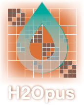

# H2Opus: a performance-oriented library for hierarchical matrices

<!-- 
 -->

<!-- 
 -->

H2Opus is a modern high-performance library for linear algebra operations with hierarchical matrices. It supports the H2 format which provides asymptotically optimal storage complexity, particularly useful in modern computing environments that are provisioned with high processing power relative to memory capacity. The library is accelerated on machines with GPUs. Both single and double precision formats are supported. It can also run on CPU-only machines. The library supports weak admissiblity hierarchical matrix partitioning as well as general partitioning resulting from strong admissiblity conditions.

Every block Aij in an H2 hierarchical matrix is stored in the form Ui Sij VjT, where nested column/row bases U and V, and coupling blocks S are stored in multi-level hierarchical tree data structures, suitably flattened for efficient GPU execution. H2 matrices are therefore natural generalizations of globally low rank matrix approximations which are frequently represented in their factorized rank-k form: BNxk Skxk CNxkT.

The H2Opus library currently includes support for the following operations:

* Generation of matrix structure from a point set and admissibility condition.
* Construction of a hierarchical matrix given a kernel function.
* Matrix-vector and matrix-multiple-vector multiplication (Hgemv).
* Basis orthogonalization (Horthog), which generates orthogonal bases U and V from non-orthogonal ones and projects the matrix data on them.
* Algebraic compression (Hcompress). Given a desired approximation, generates smaller-rank bases U and V and projects the matrix data on them.
* Low rank update (HLRU), which adds a low rank matrix XXT and compresses the resulting sum.
* Local low rank update, which adds a low rank submatrix to a hierarchical matrix and compresses the result.
* Construction from mat-vec sampling (HARA). Constructs an H2 matrix representation of a linear operator accessible only through matrix-vector products, using multi-level adaptive randomized approximations. The HARA operation allows matrix-matrix multiplication to be performed and general algebraic matrix expressions to be evaluated.
* Tile-Low-rank representantion and fast sequential symmetric factorizations.
* Multi-GPU support for Hgemv, Horthog and Hcompress operations.

Please use the issue tracker to request new features.

## Installation

The INSTALL file in the top level directory has installation instructions. For NVIDIA GPU execution, the library has [MAGMA](https://icl.utk.edu/magma/) as an external dependency. Lower level batched linear algebra routines of H2Opus are packaged separately in the [KBLAS](https://github.com/ecrc/kblas) library, which should also be installed. For CPU-only execution, the [Thrust library](https://github.com/NVIDIA/thrust) should be installed. The library needs to be linked against BLAS and LAPACK, and can use special libraries if available, including MKL, ESSL, and AOCL libraries specialized for AMD CPUs. The library can be also compiled for the NEC-SX Vector Engine. Additional information can be found in the various configuration files provided in [config](config/).

## Documentation

This software is accompanied by a set of commented examples that serve the purpose of documenting the usage of its various capabilities, including using it from [PETSc](https://petsc.org/) or [SLEPc](https://slepc.upv.es/).

Each example is in its own directory in [examples](examples/) and it can be built independently.

## Related Publications

1. Stefano Zampini, Wajih Boukaram, George Turkiyyah, David Keyes, H2Opus: A distributed-memory multi-GPU software package for non-local operators. *Advances in Computational Mathematics*, 48, 31 (2022)

2. Wajih Boukaram, Stefano Zampini, George Turkiyyah, David Keyes, H2OPUS-TLR: High Performance Tile Low Rank Symmetric Factorizations using Adaptive Randomized Approximation. https://arxiv.org/abs/2108.11932 (2021)

3. Wajih Boukaram, Marco Lucchesi, George Turkiyyah, Olivier Le Maître, Omar Knio, David Keyes,  Hierarchical matrix approximations for space-fractional diffusion equations. *Comput Methods Appl Mech Eng*, 369:113191 (2020)

4. David Keyes, Hatem Ltaief, George Turkiyyah, Hierarchical Algorithms on Hierarchical Architectures, *Phil. Trans. R. Soc. A.*, 378:20190055 (2020)

5. Wajih Boukaram, George Turkiyyah, David Keyes, Randomized GPU Algorithms for the Construction of Hierarchical Matrices from Matrix-Vector Operations. *SIAM J. Sci. Comput.* 41(4): C339-C366 (2019)

6. Wajih Halim Boukaram, George Turkiyyah, David Keyes, Hierarchical Matrix Operations on GPUs: Matrix-Vector Multiplication and Compression. *ACM Trans. Math. Softw.* 45(1): 3:1-3:28 (2019)

7. Wajih Halim Boukaram, George Turkiyyah, Hatem Ltaief, David Keyes, Batched QR and SVD algorithms on GPUs with applications in hierarchical matrix compression, *Parallel Computing*, 74:19-33 (2018)
